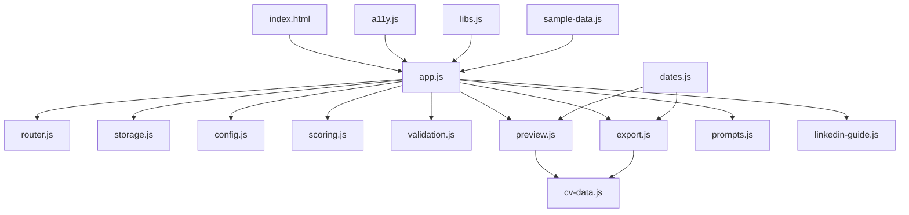

# Arquitetura do Sistema - Eu Gero Meu Currículo

Este documento descreve a organização técnica, stack tecnológica, fluxo de dados e decisões arquiteturais do projeto **Eu Gero Meu Currículo**.

---

## 1. Stack Tecnológica

O projeto é construído como uma aplicação web estática, focada em privacidade (zero-server) e compatibilidade offline:

- **Frontend Core:** HTML5 semântico, CSS3 com variáveis customizadas para estilização e templates, JavaScript Vanilla (ES6+).
- **Sem Frameworks:** Nenhum framework SPA (React/Vue), bundler (Webpack/Vite) ou transpilação (Babel) é utilizado. O código roda diretamente no browser.
- **Bibliotecas Externas (via CDN ou fallback local em `vendor/`):**
  - **jsPDF (v2.5.1):** Utilizado para renderização e exportação de PDFs A4 no lado do cliente.
  - **QRCode.js (v1.5.3):** Gera o QR Code dinâmico do perfil do LinkedIn no PDF.
  - **docx.js (dinâmico):** Carregado sob demanda via CDN para gerar arquivos do Word `.docx`.

---

## 2. Visão Geral da Arquitetura e Estrutura de Arquivos

Os arquivos JavaScript do projeto estão estruturados sob o namespace global `EuGero*`, organizados de forma modular e com responsabilidades específicas:

### Detalhe dos Módulos

- **`index.html`:** Ponto de entrada que carrega os estilos CSS, a estrutura HTML básica e todos os scripts JavaScript na ordem adequada.
- **`js/app.js`:** Controlador e orquestrador principal da aplicação. Gerencia eventos do DOM, ciclo de vida das telas, sincronização do formulário e chamada para os outros módulos.
- **`js/config.js`:** Contém todas as configurações estáticas das seções do currículo, schemas dos campos, lista de verbos de ação para scoring e metadados dos templates visuais (atsFriendly, layouts).
- **`js/router.js`:** Roteamento baseado em hash do navegador (`#/`, `#/start`, `#/wizard/:id`, `#/review`, `#/guide`), permitindo navegação por histórico (Voltar/Avançar).
- **`js/storage.js`:** Controla a persistência no `localStorage`, validação de arquivos carregados e serialização/desserialização do JSON de backup.
- **`js/validation.js`:** Lógica pura de validação de e-mails, URLs, campos obrigatórios e comprimento mínimo de caracteres.
- **`js/scoring.js`:** Responsável pela nota de qualidade inline (Fraco/Bom/Ótimo), presença de verbos de ação e números, e a simulação de encaixe (fit) em uma página A4 (contagem de caracteres e itens).
- **`js/cv-data.js`:** Normaliza e padroniza o estado do formulário em um modelo de dados estruturado único (`CvData`), usado como fonte da verdade no preview e nas exportações.
- **`js/preview.js`:** Manipula o DOM da aba de preview para exibir o currículo em tempo real formatado pelo CSS do template selecionado.
- **`js/export.js`:** Implementa a geração cliente-side de PDF (inserindo QR Code), Word (.docx) e arquivos de texto (.txt).
- **`js/prompts.js`:** Cria prompts estruturados de IA para suporte externo (geral, tradução e seção individual), injetando ou ocultando dados reais.
- **`js/linkedin-guide.js`:** Formata e exibe os textos prontos para copiar e colar nas caixas correspondentes do perfil LinkedIn.
- **`js/a11y.js`:** Controla foco em modais e acessibilidade do teclado (Esc, focus trap).
- **`js/dates.js`:** Funções puras utilitárias para lidar com períodos e datas.
- **`js/libs.js`:** Detecta dinamicamente a presença de scripts jsPDF e QRCode carregados na janela.

---

## 3. Decisões Arquiteturais e Fluxo de Dados

1. **Estado Único na Memória:** O estado da aplicação segue o formato gerado por `EuGeroConfig.createEmptyState()`. O `app.js` mantém o estado atualizado em memória e dispara `EuGeroStorage.save()` a cada alteração de input.
2. **Auto-save Reativo:** Não há botão de "Salvar". Cada digitação ou seleção atualiza o estado em memória e grava no `localStorage`.
3. **Página Única (SPA) por Hash:** As transições de tela ocultam/exibem containers HTML usando o atributo `hidden`, disparado pelo listener de `hashchange` monitorado pelo `router.js`.
4. **Isolamento de Lógica e Renderização:** Módulos de cálculo e dados (`validation`, `scoring`, `cv-data`, `prompts`, `storage`) são puramente matemáticos e lógicos, o que viabiliza a execução de testes automatizados unitários no ambiente Node.js sem necessidade de emular o DOM (JSDOM).
